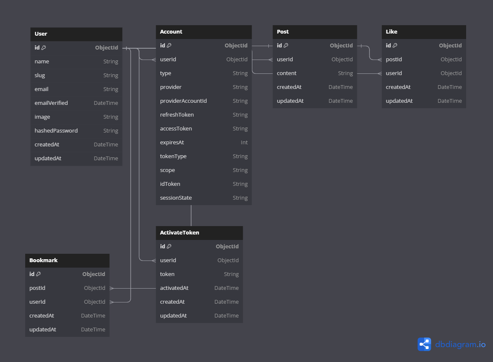

# 🌟 Aplikasi Sosial Media 🌟

Aplikasi ini memungkinkan pengguna untuk mendaftar, masuk, membuat post, menyukai post, menandai post sebagai bookmark, dan mengubah foto profil.

## 🚀 Fitur Utama

### 1. **Pendaftaran dan Autentikasi Pengguna**

- 🔑 **Register:** Pengguna dapat membuat akun menggunakan email dan kata sandi atau melalui OAuth.
- 🌐 **Login:** Pengguna dapat masuk menggunakan kredensial atau melalui OAuth.
- 🖼️ **Ganti Foto Profil:** Pengguna dapat mengubah foto profil mereka.

### 2. **Membuat Post**

- 📝 **Buat Post:** Pengguna dapat membuat post baru setelah masuk.
- 📸 **Unggah Foto:** Pengguna akan dapat mengunggah foto pada setiap post. _(Coming soon)_
- 💬 **Komentar:** Pengguna akan dapat memberikan komentar pada post. _(Coming soon)_

### 3. **Interaksi dengan Post**

- ❤️ **Like:** Pengguna dapat menyukai post dari pengguna lain.
- 📚 **Bookmark:** Pengguna dapat menandai post sebagai bookmark.

## 🧰 Teknologi dan Alat

- **Backend & Frontend:** Nextjs 13
- **Database:** MongoDB
- **Autentikasi:** Nextauth

## 📐 Model Database

### 1. **User**

Menyimpan informasi pengguna. Relasi ke Post, Like, Bookmark, dan ActivateToken.

### 2. **Account**

Menyimpan informasi akun OAuth pengguna. Relasi ke User.

### 3. **Post**

Menyimpan konten post pengguna. Relasi ke User, Like, dan Bookmark.

### 4. **Like**

Menyimpan informasi post yang disukai oleh pengguna. Relasi ke User dan Post.

### 5. **Bookmark**

Menyimpan informasi post yang ditandai sebagai bookmark oleh pengguna. Relasi ke User dan Post.

### 6. **ActivateToken**

Menyimpan token aktivasi untuk pengguna. Relasi ke User.
